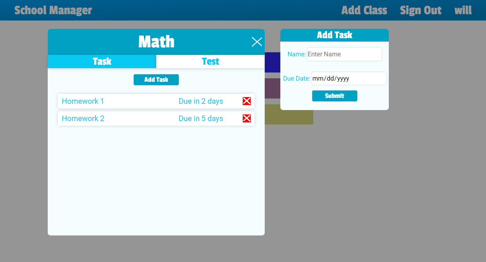

# School-Manager

## Description

> This project helps students manage their school life. Students can log all their classes, tasks, and tests. This will allow them to never miss a test or homework assignment again.

## Timeline

> March 13, 2019 - March 30, 2019 (Main Application)
>
> June 19, 2019
>
> * Added the ability to delete Classes
> * Can now login as guest

## Technology

> * Express
>   * express-sessions
> * Node.js
> * React
>   * react-router
>   * react-redux
>   * react-spring
>   * react-transition-groups
> * MongoDB
>   * mongoose

## What I learned

> * react-spring
> * react-transition-groups
> * MongoDB
> * Sessions
> * cookies
> * mongoose
> * Unit Testing
> * Jest
> * Enzyme

## How to install

To view or edit this project, follow these instructions
```
git clone https://github.com/williamj1788/School-Manager
cd School-Manager
npm install && npm install --prefix client
npm run dev
```
The project should show open up in a new tab

If it doesn't, you can view it on localhost 3000

## Pages

> You can view this site [here](https://schoolmanager03.herokuapp.com)

### Login


### Dashboard


### Task

